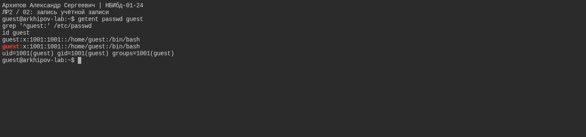
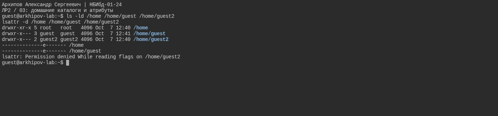
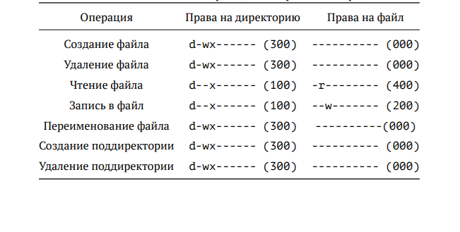

---
## Author
author:
  name: Архипов Александр Сергеевич
  email: 1132239106@rudn.ru
  group: НБИбд-01-24
  student-id: "1132239106"
  affiliation:
    - name: Российский университет дружбы народов
      country: Российская Федерация
      postal-code: 117198
      city: Москва
      address: ул. Миклухо-Маклая, д. 6

## Title
title: "Доклад по лабораторной работе №2"
subtitle: "Дискреционное разграничение прав в Linux. Основные атрибуты"
license: CC BY
date: today
date-format: "YYYY-MM-DD"
---

# Цели и задачи работы

## Цель лабораторной работы

Получить практические навыки работы в консоли с атрибутами файлов, закрепить теоретические основы дискреционного разграничения доступа в современных системах с открытым кодом на базе ОС Linux.

# Процесс выполнения лабораторной работы

## Определяем UID и группу

{#fig-real-001 width=95%}

## Файл с данными о пользователях

{#fig-real-002 width=95%}

## Права доступа к домашним каталогам

{#fig-real-003 width=95%}

## Атрибуты директории

{#fig-real-004 width=95%}

## Права и разрешённые действия

{ #fig-05 }

## Среда выполнения

Новые снимки выполнены в Ubuntu 24.04 на Killercoda. Пользователь guest имеет UID/GID 1001. Учётную запись создал администратор, парольный вход заблокирован; вход выполнен через su. На снимках проверены режимы 000, 100, 200 и 300. Полная таблица 64 пар прав ниже сохранена как теоретическая таблица, её строки не подтверждены этими пятью снимками.

## режимы каталога 100, 200, 300

{#fig-real-005 width=95%}

# Выводы по проделанной работе

## Вывод

В ходе выполнения лабораторной работы были получены навыки работы с атрибутами файлов и сведения о разграничении доступа.
