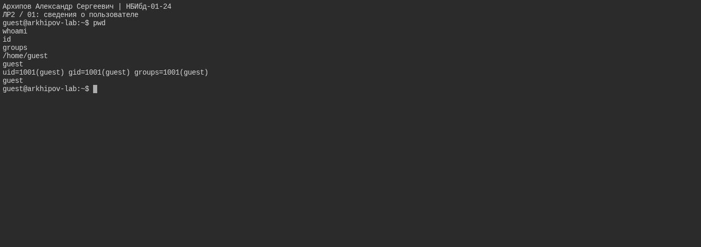
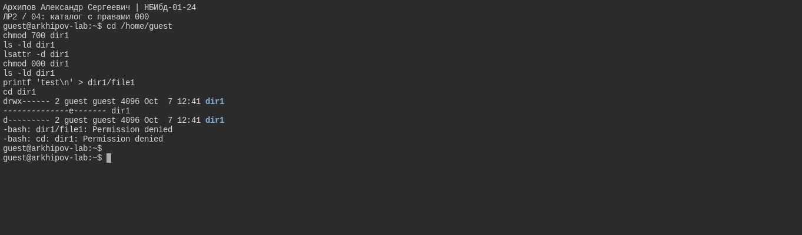
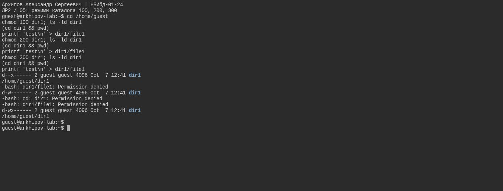

---
## Author
author:
  name: Архипов Александр Сергеевич
  email: 1132239106@rudn.ru
  group: НБИбд-01-24
  student-id: "1132239106"
  affiliation:
    - name: Российский университет дружбы народов
      country: Российская Федерация
      postal-code: 117198
      city: Москва
      address: ул. Миклухо-Маклая, д. 6

## Title
title: "Отчёт по лабораторной работе №2"
subtitle: "Дискреционное разграничение прав в Linux. Основные атрибуты"
license: "CC BY"
---

# Цель работы

Получить практические навыки работы в консоли с атрибутами файлов, закрепить теоретические основы дискреционного разграничения доступа в современных системах с открытым кодом на базе ОС Linux.

# Выполнение лабораторной работы

Новые снимки выполнены в Ubuntu 24.04 на Killercoda. Пользователь guest имеет UID/GID 1001. Учётную запись создал администратор, парольный вход заблокирован; вход выполнен через su. На снимках проверены режимы 000, 100, 200 и 300. Полная таблица 64 пар прав ниже сохранена как теоретическая таблица, её строки не подтверждены этими пятью снимками.

## сведения о пользователе

Сеанс принадлежит guest, рабочий каталог /home/guest. UID/GID этой ВМ: 1001/1001.

{#fig-real-001 width=95%}

## запись учётной записи

UID/GID в /etc/passwd совпадают с id. Это фактическая запись новой учебной ВМ.

{#fig-real-002 width=95%}

## домашние каталоги и атрибуты

Атрибуты /home и своего дома доступны. Для чужого /home/guest2 с режимом 750 lsattr от guest получает отказ: это ожидаемый контроль доступа.

{#fig-real-003 width=95%}

## каталог с правами 000

При 000 владелец не может создать файл и войти в каталог. Оба Permission denied ожидаемы.

{#fig-real-004 width=95%}

## режимы каталога 100, 200, 300

100: вход разрешён, создание запрещено; 200: оба действия запрещены; 300: оба разрешены. Снимок проверяет эти три режима, а не полную матрицу 64 пар прав.

{#fig-real-005 width=95%}

1 - Создание файла

2- Удаление файла

3- Запись в файл

4- Чтение файла

5- Смена директории

6- Просмотр имён файлов в директории (ls, без получения их метаданных)

7 - Переименование файла

8- Смена атрибутов файла

: Установленные права и разрешённые действия {#tbl-rig-act}

|Права директории|Права файла|1|2|3|4|5|6|7|8|
|:---|:---|---|---|---|---|---|---|---|---|
|```d---------(000)```|```----------(000)```|-|-|-|-|-|-|-|-|
|```d--x------(100)```|```----------(000)```|-|-|-|-|+|-|-|+|
|```d-w-------(200)```|```----------(000)```|-|-|-|-|-|-|-|-|
|```d-wx------(300)```|```----------(000)```|+|+|-|-|+|-|+|+|
|```dr--------(400)```|```----------(000)```|-|-|-|-|-|+|-|-|
|```dr-x------(500)```|```----------(000)```|-|-|-|-|+|+|-|+|
|```drw-------(600)```|```----------(000)```|-|-|-|-|-|+|-|-|
|```drwx------(700)```|```----------(000)```|+|+|-|-|+|+|+|+|
|```d---------(000)```|```---x------(100)```|-|-|-|-|-|-|-|-|
|```d--x------(100)```|```---x------(100)```|-|-|-|-|+|-|-|+|
|```d-w-------(200)```|```---x------(100)```|-|-|-|-|-|-|-|-|
|```d-wx------(300)```|```---x------(100)```|+|+|-|-|+|-|+|+|
|```dr--------(400)```|```---x------(100)```|-|-|-|-|-|+|-|-|
|```dr-x------(500)```|```---x------(100)```|-|-|-|-|+|+|-|+|
|```drw-------(600)```|```---x------(100)```|-|-|-|-|-|+|-|-|
|```drwx------(700)```|```---x------(100)```|+|+|-|-|+|+|+|+|
|```d---------(000)```|```--w-------(200)```|-|-|-|-|-|-|-|-|
|```d--x------(100)```|```--w-------(200)```|-|-|+|-|+|-|-|+|
|```d-w-------(200)```|```--w-------(200)```|-|-|-|-|-|-|-|-|
|```d-wx------(300)```|```--w-------(200)```|+|+|+|-|+|-|+|+|
|```dr--------(400)```|```--w-------(200)```|-|-|-|-|-|+|-|-|
|```dr-x------(500)```|```--w-------(200)```|-|-|+|-|+|+|-|+|
|```drw-------(600)```|```--w-------(200)```|-|-|-|-|-|+|-|-|
|```drwx------(700)```|```--w-------(200)```|+|+|+|-|+|+|+|+|
|```d---------(000)```|```--wx------(300)```|-|-|-|-|-|-|-|-|
|```d--x------(100)```|```--wx------(300)```|-|-|+|-|+|-|-|+|
|```d-w-------(200)```|```--wx------(300)```|-|-|-|-|-|-|-|-|
|```d-wx------(300)```|```--wx------(300)```|+|+|+|-|+|-|+|+|
|```dr--------(400)```|```--wx------(300)```|-|-|-|-|-|+|-|-|
|```dr-x------(500)```|```--wx------(300)```|-|-|+|-|+|+|-|+|
|```drw-------(600)```|```--wx------(300)```|-|-|-|-|-|+|-|-|
|```drwx------(700)```|```--wx------(300)```|+|+|+|-|+|+|+|+|
|```d---------(000)```|```-r--------(400)```|-|-|-|-|-|-|-|-|
|```d--x------(100)```|```-r--------(400)```|-|-|-|+|+|-|-|+|
|```d-w-------(200)```|```-r--------(400)```|-|-|-|-|-|-|-|-|
|```d-wx------(300)```|```-r--------(400)```|+|+|-|+|+|-|+|+|
|```dr--------(400)```|```-r--------(400)```|-|-|-|-|-|+|-|-|
|```dr-x------(500)```|```-r--------(400)```|-|-|-|+|+|+|-|+|
|```drw-------(600)```|```-r--------(400)```|-|-|-|-|-|+|-|-|
|```drwx------(700)```|```-r--------(400)```|+|+|-|+|+|+|+|+|
|```d---------(000)```|```-r-x------(500)```|-|-|-|-|-|-|-|-|
|```d--x------(100)```|```-r-x------(500)```|-|-|-|+|+|-|-|+|
|```d-w-------(200)```|```-r-x------(500)```|-|-|-|-|-|-|-|-|
|```d-wx------(300)```|```-r-x------(500)```|+|+|-|+|+|-|+|+|
|```dr--------(400)```|```-r-x------(500)```|-|-|-|-|-|+|-|-|
|```dr-x------(500)```|```-r-x------(500)```|-|-|-|+|+|+|-|+|
|```drw-------(600)```|```-r-x------(500)```|-|-|-|-|-|+|-|-|
|```drwx------(700)```|```-r-x------(500)```|+|+|-|+|+|+|+|+|
|```d---------(000)```|```-rw-------(600)```|-|-|-|-|-|-|-|-|
|```d--x------(100)```|```-rw-------(600)```|-|-|+|+|+|-|-|+|
|```d-w-------(200)```|```-rw-------(600)```|-|-|-|-|-|-|-|-|
|```d-wx------(300)```|```-rw-------(600)```|+|+|+|+|+|-|+|+|
|```dr--------(400)```|```-rw-------(600)```|-|-|-|-|-|+|-|-|
|```dr-x------(500)```|```-rw-------(600)```|-|-|+|+|+|+|-|+|
|```drw-------(600)```|```-rw-------(600)```|-|-|-|-|-|+|-|-|
|```drwx------(700)```|```-rw-------(600)```|+|+|+|+|+|+|+|+|
|```d---------(000)```|```-rwx------(700)```|-|-|-|-|-|-|-|-|
|```d--x------(100)```|```-rwx------(700)```|-|-|+|+|+|-|-|+|
|```d-w-------(200)```|```-rwx------(700)```|-|-|-|-|-|-|-|-|
|```d-wx------(300)```|```-rwx------(700)```|+|+|+|+|+|-|+|+|
|```dr--------(400)```|```-rwx------(700)```|-|-|-|-|-|+|-|-|
|```dr-x------(500)```|```-rwx------(700)```|-|-|+|+|+|+|-|+|
|```drw-------(600)```|```-rwx------(700)```|-|-|-|-|-|+|-|-|
|```drwx------(700)```|```-rwx------(700)```|+|+|+|+|+|+|+|+|

Минимальные права ниже приведены по правилам дискреционного доступа Linux. Новые снимки подтверждают только описанные выше режимы.

: Минимальные права для совершения операций {#tbl-min-rig}

|Операция|Права на директорию|Права на файл|
|:---:|:---:|:---:|
|Создание файла|```d-wx------ (300)```|```---------- (000)```|
|Удаление файла|```d-wx------ (300)```|```---------- (000)```|
|Чтение файла|```d--x------ (100)```|```-r-------- (400)```|
|Запись в файл|```d--x------ (100)```|```--w------- (200)```|
|Переименование файла|```d-wx------ (300)```|```----------(000)```|
|Создание поддиректории|```d-wx------ (300)```|```---------- (000)```|
|Удаление поддиректории|```d-wx------ (300)```|```---------- (000)```|

# Вывод

В ходе выполнения лабораторной работы были получены навыки работы с атрибутами файлов и сведения о разграничении доступа.

# Список литературы{.unnumbered}

1. [Теория разграничения прав пользователей](https://moodle.kstu.ru/pluginfile.php/318215/mod_resource/content/1/Теория_разграничение_прав_пользователи.pdf)
2. [Разрешения доступа к файлам](https://linuxcommand.ru/razresheniya-dostupa-k-failam/)
