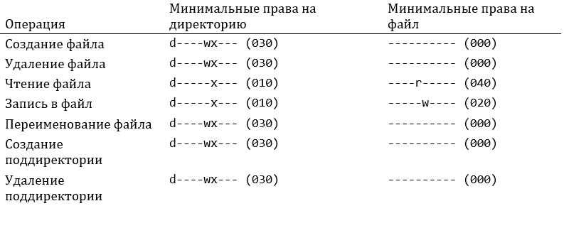
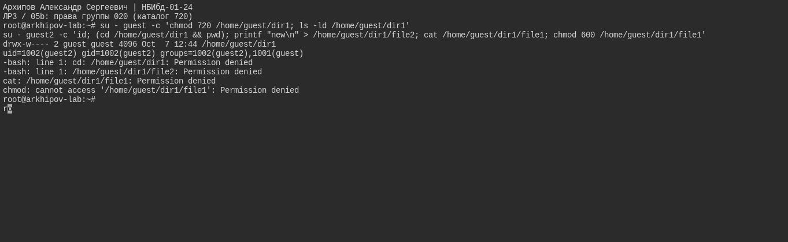

---
## Author
author:
  name: Архипов Александр Сергеевич
  email: 1132239106@rudn.ru
  group: НБИбд-01-24
  student-id: "1132239106"
  affiliation:
    - name: Российский университет дружбы народов
      country: Российская Федерация
      postal-code: 117198
      city: Москва
      address: ул. Миклухо-Маклая, д. 6

## Title
title: "Доклад по лабораторной работе №3"
subtitle: "Дискреционное разграничение прав в Linux. Два пользователя"
license: CC BY
date: today
date-format: "YYYY-MM-DD"
---

# Цели и задачи работы

## Цель лабораторной работы

Получение практических навыков работы в консоли с атрибутами файлов для групп пользователей.

# Процесс выполнения лабораторной работы

## Определяем UID и группу двух пользователей

{#fig-real-001 width=95%}

## Файл с данными о пользователях

{#fig-real-002 width=95%}

## Атрибуты директории

{#fig-real-003 width=95%}

## Заполнение таблицы

{#fig-real-004 width=95%}

## Права и разрешённые действия

{ #fig-005 width=70% }

## Среда выполнения

Проверки выполнены в Ubuntu 24.04. UID/GID guest — 1001, UID/GID guest2 — 1002. У guest2 есть дополнительная группа guest. Парольный вход заблокирован, входы выполнены администратором через su. На снимках проверены каталог 000 и групповые режимы 710, 720 и 730. Полная таблица ниже содержит теоретические значения; все 64 пары прав повторно не проверялись.

## добавление guest2 в группу guest

{#fig-real-005 width=95%}

## права группы 020 (каталог 720)

{#fig-real-006 width=95%}

## права группы 030 (каталог 730)

{#fig-real-007 width=95%}

# Выводы по проделанной работе

## Вывод

В ходе выполнения работы, мы смогли приобрести практические навыки работы в консоли с атрибутами файлов для групп пользователей.
