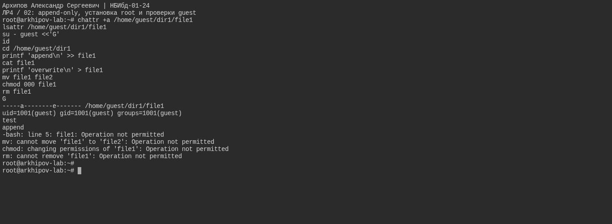
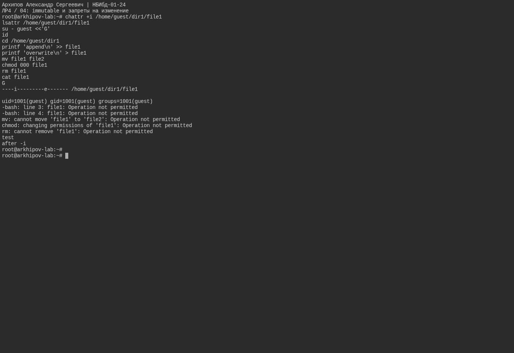
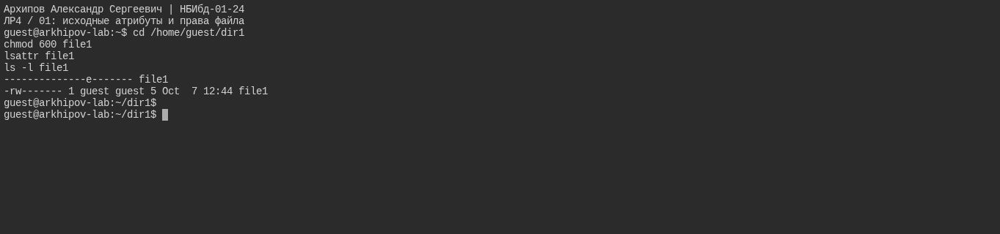
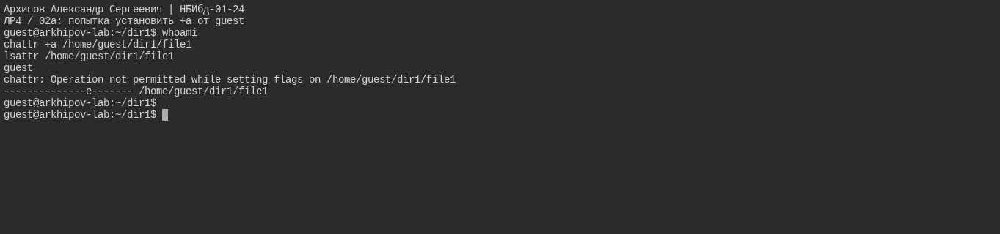
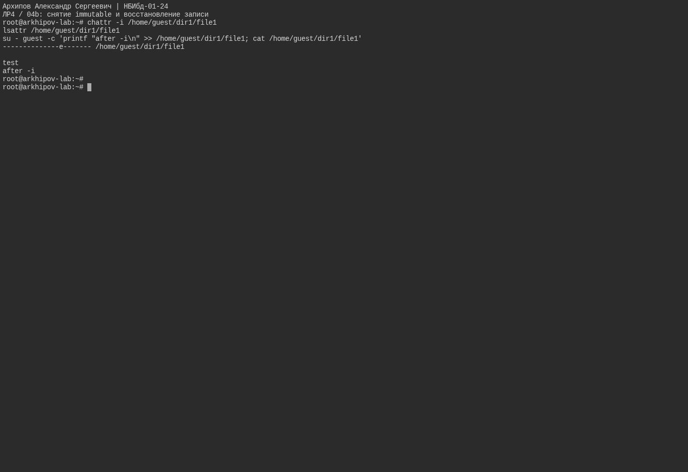

---
## Author
author:
  name: Архипов Александр Сергеевич
  email: 1132239106@rudn.ru
  group: НБИбд-01-24
  student-id: "1132239106"
  affiliation:
    - name: Российский университет дружбы народов
      country: Российская Федерация
      postal-code: 117198
      city: Москва
      address: ул. Миклухо-Маклая, д. 6

## Title
title: "Доклад по лабораторной работе №4"
subtitle: "Дискреционное разграничение прав в Linux. Расширенные атрибуты"
license: CC BY
date: today
date-format: "YYYY-MM-DD"
---

# Цели и задачи работы

## Цель лабораторной работы

Получение практических навыков работы в консоли с расширенными атрибутами файлов.

# Процесс выполнения лабораторной работы

## Теоретическое введение

Помимо прав доступа каждый из файлов стандартной файловой системы Linux имеет набор атрибутов, регламентирующих особенности работы с ним. Chattr - это команда в Linux,
которая позволяет пользователю устанавливать и снимать определенные атрибуты файла. Доступны следующие атрибуты: a, A, c, C, D, e, i, j, s, S, t, u.

## Расширенный атрибут а

{#fig-real-001 width=95%}

## Расширенный атрибут i

{#fig-real-002 width=95%}

#
## Среда выполнения

Проверки выполнены на ext4 в Ubuntu 24.04. Установка и снятие a/i выполнены от root, проверки доступа — от guest. В конце оба временных атрибута сняты.

## исходные атрибуты и права файла

{#fig-real-003 width=95%}

## попытка установить +a от guest

{#fig-real-004 width=95%}

## снятие +a и восстановление операций

{#fig-real-005 width=95%}

## снятие immutable и восстановление записи

{#fig-real-006 width=95%}

# Вывод

Получены практические навыки работы в консоли с расширенными атрибутами файлов.
