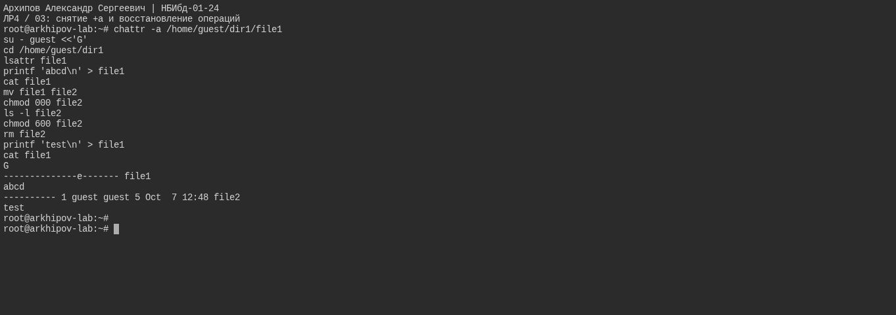

---
## Author
author:
  name: Архипов Александр Сергеевич
  email: 1132239106@rudn.ru
  group: НБИбд-01-24
  student-id: "1132239106"
  affiliation:
    - name: Российский университет дружбы народов
      country: Российская Федерация
      postal-code: 117198
      city: Москва
      address: ул. Миклухо-Маклая, д. 6

## Title
title: "Отчёт по лабораторной работе №4"
subtitle: "Дискреционное разграничение прав в Linux. Расширенные атрибуты"
license: "CC BY"
---

# Цель работы

Получение практических навыков работы в консоли с расширенными атрибутами файлов.

# Выполнение лабораторной работы

Проверки выполнены на ext4 в Ubuntu 24.04. Установка и снятие a/i выполнены от root, проверки доступа — от guest. В конце оба временных атрибута сняты.

## исходные атрибуты и права файла

Обычный file1 принадлежит guest, режим 600. Атрибут e для ext4 не является append-only или immutable.

{#fig-real-001 width=95%}

## попытка установить +a от guest

guest не обладает правом устанавливать a; Operation not permitted ожидаем.

{#fig-real-002 width=95%}

## append-only, установка root и проверки guest

После установки a администратором guest может читать и дописывать. Перезапись, mv, chmod и rm запрещены.

{#fig-real-003 width=95%}

## снятие +a и восстановление операций

После -a снова разрешены перезапись, переименование, chmod и удаление. Учебный file1 создан заново.

{#fig-real-004 width=95%}

## immutable и запреты на изменение

С i запрещены дозапись, перезапись, mv, chmod и rm. Чтение разрешено. В этой повторной проверке файл содержит test и ранее добавленную строку after -i.

{#fig-real-005 width=95%}

## снятие immutable и восстановление записи

После -i дозапись проходит; содержимое подтверждено cat.

{#fig-real-006 width=95%}

# Выводы

Получены практические навыки работы в консоли с расширенными атрибутами файлов.

# Список литературы{.unnumbered}

1. [КОМАНДА CHATTR В LINUX](https://losst.ru/neizmenyaemye-fajly-v-linux)
2. [chattr](https://en.wikipedia.org/wiki/Chattr)
