---
## Author
author:
  name: Архипов Александр Сергеевич
  email: 1132239106@rudn.ru
  group: НБИбд-01-24
  student-id: "1132239106"
  affiliation:
    - name: Российский университет дружбы народов
      country: Российская Федерация
      postal-code: 117198
      city: Москва
      address: ул. Миклухо-Маклая, д. 6

## Title
title: "Отчёт по лабораторной работе №5"
subtitle: "Дискреционное разграничение прав в Linux. Исследование влияния дополнительных атрибутов"
license: "CC BY"
---

# Цель работы

Изучение механизмов изменения идентификаторов, применения SetUID и Sticky-битов. Получение практических навыков работы в консоли с дополнительными атрибутами. Рассмотрение работы механизма смены идентификатора процессов пользователей, а также влияние бита Sticky на запись и удаление файлов.

# Выполнение лабораторной работы

Работа выполнена в Ubuntu 24.04 с GCC 13.3. Здесь активен AppArmor, SELinux не включён: этап setenforce 0 / Permissive не выполнялся. Опыты с UID/GID, SetUID/SetGID и Sticky-битом выполнены реально. Для Sticky-бита использован отдельный каталог /tmp/lab05-sticky; глобальные права /tmp не изменялись. После опытов временные SetUID/SetGID сняты, каталог восстановлен в режиме 1777.

## компилятор и фактическое окружение

GCC доступен, диск ext4 не смонтирован с nosuid. Здесь AppArmor, а не SELinux: этап setenforce 0 / Permissive из Fedora не воспроизводился.

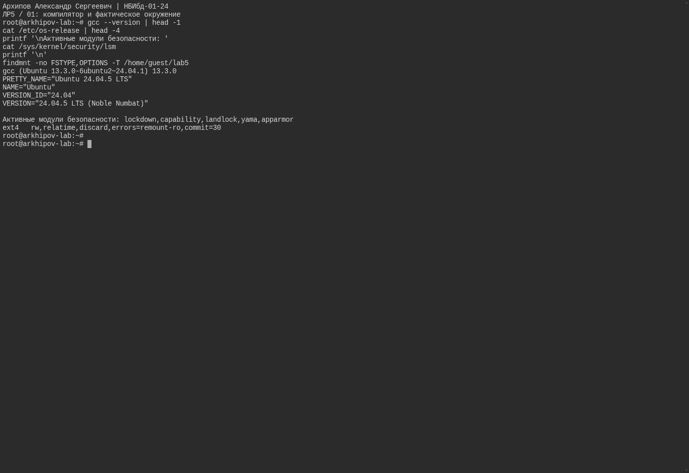{#fig-real-001 width=95%}

## исходный код simpleid.c

Программа печатает effective UID/GID из geteuid/getegid с корректными форматами для unsigned long.

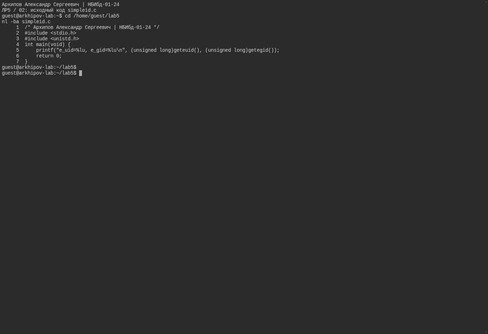{#fig-real-002 width=95%}

## компиляция и обычные UID/GID

Компиляция с -Wall -Wextra -Werror успешна. Без специальных битов e_uid/e_gid совпадают с UID/GID guest.

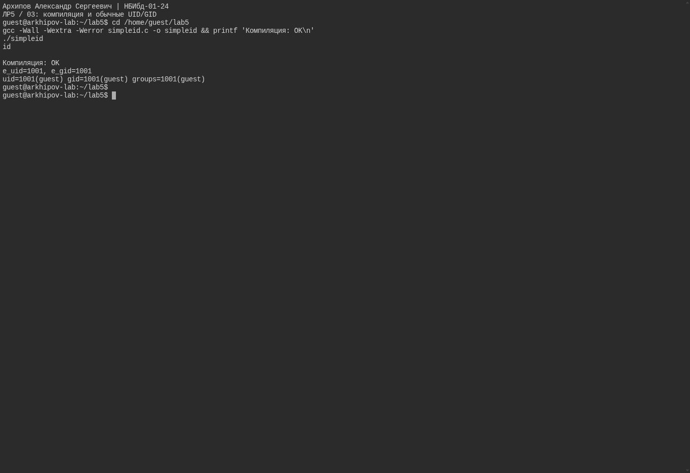{#fig-real-003 width=95%}

## исходник с real и effective UID/GID

Вторая программа отдельно печатает реальные и эффективные UID/GID. Компиляция успешна.

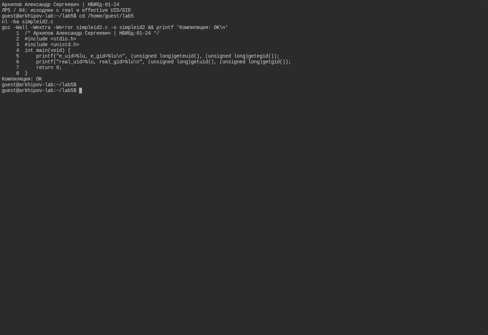{#fig-real-004 width=95%}

## SetUID, владелец программы root

При 4755 и владельце root эффективный UID программы 0, реальный UID остаётся 1001.

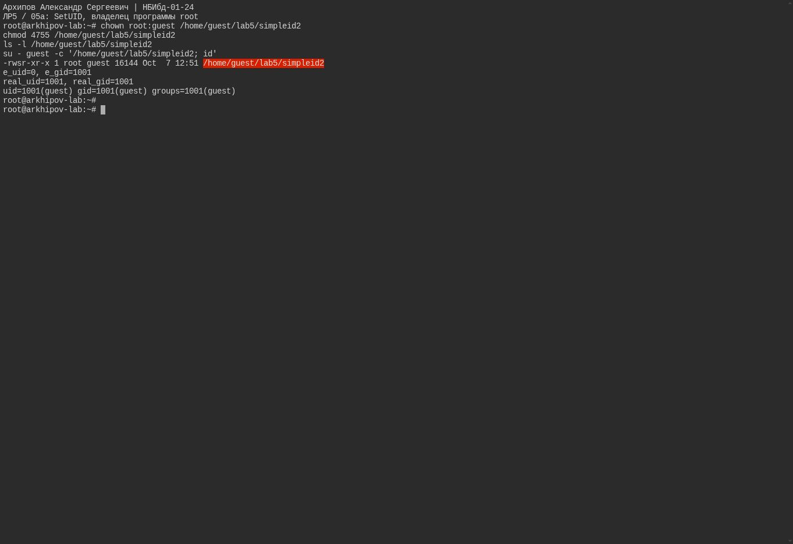{#fig-real-005 width=95%}

## SetGID, группа программы root

При 2755 и группе root эффективный GID программы 0, реальный GID остаётся 1001. SetUID здесь снят.

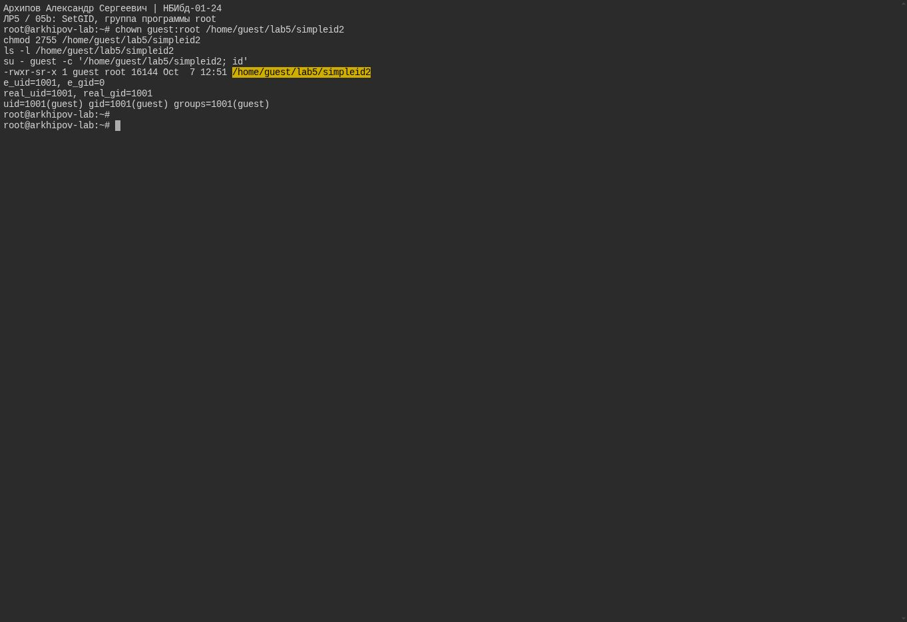{#fig-real-006 width=95%}

## исправленный исходник readfile.c

read возвращает ssize_t; цикл читает все блоки, проверяет ошибки read/fwrite. Программа компилируется без предупреждений.

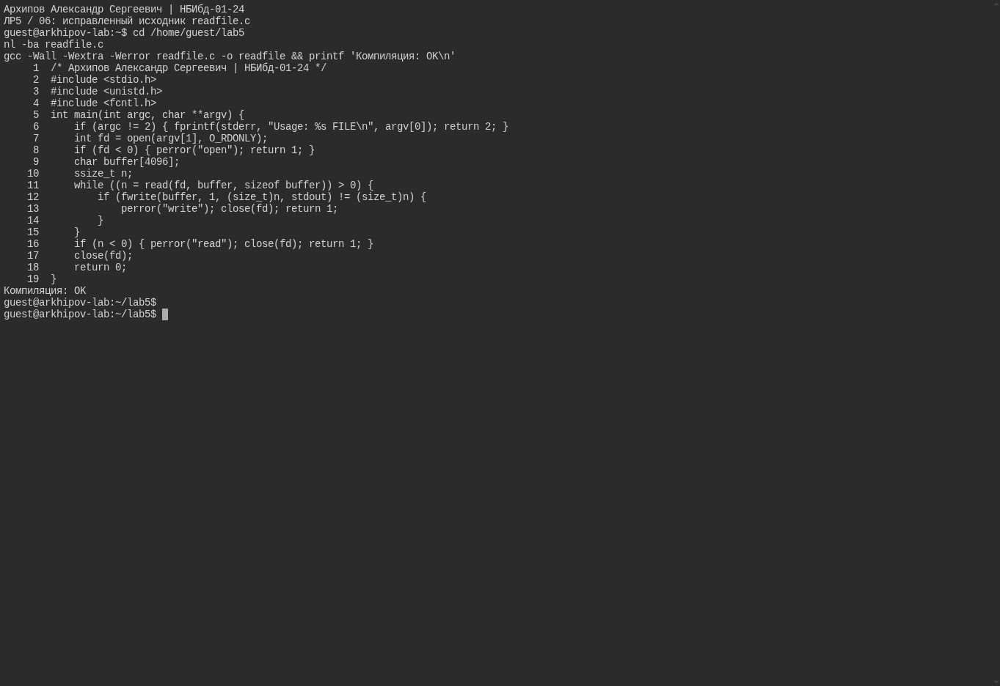{#fig-real-007 width=95%}

## чтение root-файла без SetUID

Обычный guest не может читать root-файл с 600 ни через cat, ни через readfile без SetUID.

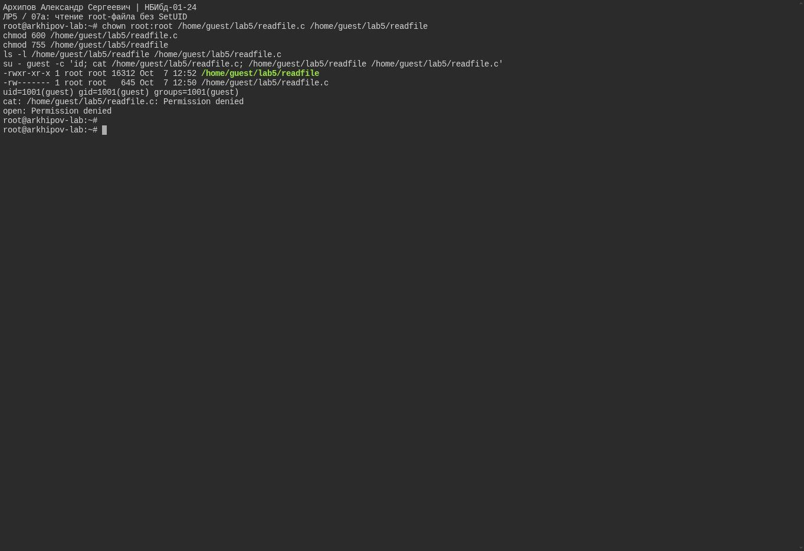{#fig-real-008 width=95%}

## чтение защищённого файла с SetUID

SetUID-программа с владельцем root читает полный защищённый исходник. Код чтения /etc/shadow равен 0; его содержимое перенаправлено в /dev/null.

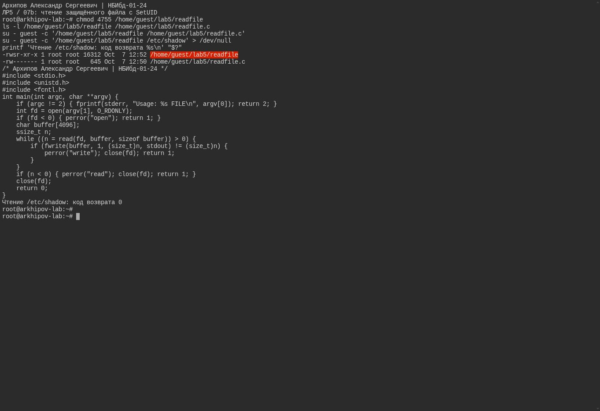{#fig-real-009 width=95%}

## Sticky-бит, чтение и запись разрешены, удаление чужого файла запрещено

В отдельном каталоге 1777 guest2 может читать и дописывать файл с 0666, но не удалить файл guest. dd без O_CREAT отделяет запись от fs.protected_regular.

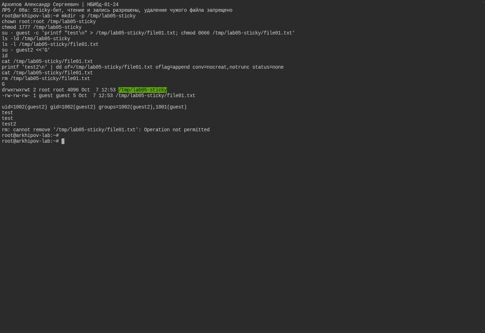{#fig-real-010 width=95%}

## снятие Sticky-бита и восстановление 1777

При 0777 guest2 удаляет чужой файл, код 0. В конце режим 1777 восстановлен. Общие права системного /tmp не менялись.

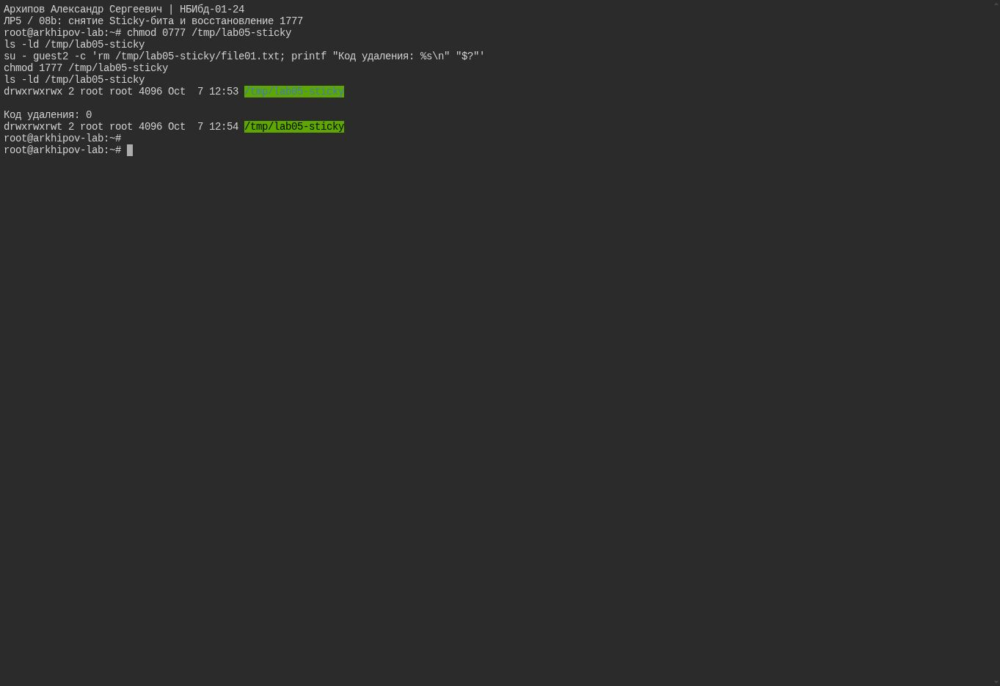{#fig-real-011 width=95%}

# Выводы

Изучили механизмы изменения идентификаторов, применения SetUID- и Sticky-битов. Получили практические навыки работы в консоли с дополнительными атрибутами. Также мы рассмотрели работу механизма смены идентификатора процессов пользователей и влияние бита Sticky на запись и удаление файлов.

# Список литературы{.unnumbered}

1. [КОМАНДА CHATTR В LINUX](https://losst.ru/neizmenyaemye-fajly-v-linux)
2. [chattr](https://en.wikipedia.org/wiki/Chattr)
