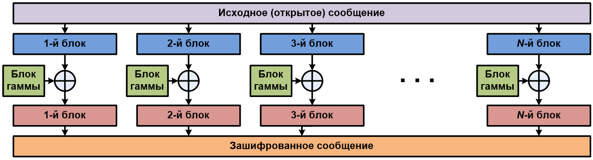
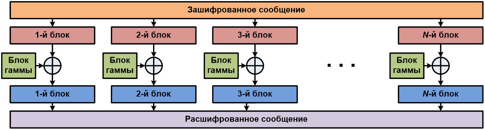
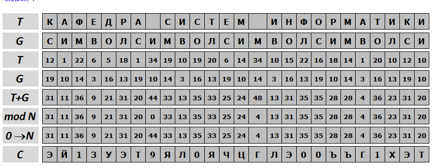
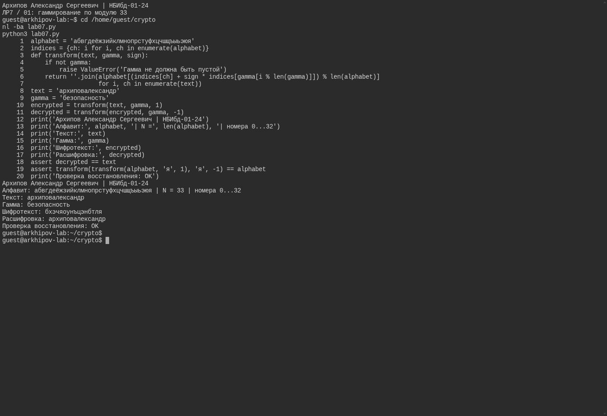

---
## Author
author:
  name: Архипов Александр Сергеевич
  email: 1132239106@rudn.ru
  group: НБИбд-01-24
  student-id: "1132239106"
  affiliation:
    - name: Российский университет дружбы народов
      country: Российская Федерация
      postal-code: 117198
      city: Москва
      address: ул. Миклухо-Маклая, д. 6

## Title
title: "Доклад по лабораторной работе №7"
subtitle: "Шифр гаммирования"
license: CC BY
date: today
date-format: "YYYY-MM-DD"
---

# Цели и задачи

## Цель лабораторной работы

Изучение алгоритма шифрования гаммированием

# Выполнение лабораторной работы

## Гаммирование

Гаммирование – это наложение (снятие) на открытые (зашифрованные) данные криптографической гаммы, т.е. последовательности элементов данных, вырабатываемых с помощью некоторого криптографического алгоритма, для получения зашифрованных (открытых) данных.

## Гаммирование

В реализованной программе символы алфавита заменяются числами 0–32. Шифрование складывает номера текста и повторяемой гаммы по модулю 33, дешифрование вычитает их по тому же модулю.

## Алгоритм

{ #fig:001 }

## Алгоритм

{ #fig:002 }

## Формула

В аддитивных шифрах символы исходного сообщения заменяются числами, которые складываются по модулю с числами гаммы. Ключом шифра является гамма, символы которой последовательно повторяются.
Перед шифрованием символы сообщения и гаммы заменяются их номерами в алфавите и само кодирование выполняется по формуле

$$ Ci = (Ti+Gi) mod N $$

## Пример работы алгоритма

{ #fig:003 }

## Пример работы программы

{#fig-real-001 width=95%}

## Среда выполнения

Программа запущена как Python-файл в настоящем терминале Ubuntu, без Jupyter. Используется единый алфавит из 33 русских букв с номерами 0–32. Это сложение и вычитание по модулю 33. Восстановление текста и проверка полного алфавита выполнены успешно.

# Выводы

## Результаты выполнения лабораторной работы

Изучили алгоритм шифрования с помощью гаммирования
